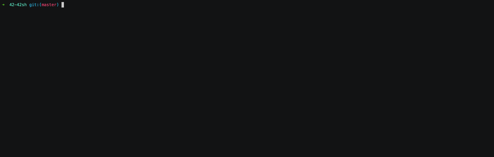

# 42sh

This project consists of creating a complete shell and uses the work done on your 21sh. A minimum set of functionalities is asked, from which your will build your own finalized shell, potentially going as far as job control and shell script. This project will involve a large variety of standard UNIX (and POSIX) functionalities.

## Project Partners

- [Abraham Gimbao](https://github.com/abguimba)
- [Alexandre Somville](https://github.com/alsomvil42)
- [Brendan Siche](https://github.com/BrendanSiche)
- [Marc Jose](https://github.com/mjose-portfolio)

## Install
------

- `make`

### Make Options

- `make`: Compiles the files and creates the executable 42sh
- `make clean`: Remove binary files.
- `make fclean`: Deletes the binary files and the 42sh executable file.
- `make re`: Deletes the binary files and the 42sh executable file and recompiles them.

## Features
------
### Builtins

- `bg`: Resume each suspended job in the background, as if it had been started with &.

- `echo`: Outputs it's args to stdout, separated by spaces, followed by a newline. The return status is always 0.

- `env`: set the environment for command invocation.
	- Options:

		`-i`: Invoke utility with exactly the environment specified by the arguments; the inherited environment shall be ignored completely.

- `exit [n]`: Shall cause the shell to exit with the exit status specified by the unsigned decimal integer n.

- `hash`: Determine and remember the full pathname of each commandname. If no arguments are given, display information about remembered command locations.

	- Options:

		`-r`: Forget all remembered locations.

- `jobs`: The first form lists the active jobs.

	- Options:

		`-p`: List only the process ID of the job’s process group leader.

- `set`: display (list) the names and values of shell variables.

- `test`: evaluate a conditional expression.

	- Options:

		`-b [pathname]`: True if `pathname` resolves to an existing directory entry for a block special file. False if `pathname` cannot be resolved, or if `pathname` resolves to an existing directory entry for a file that is not a block special file.

		`-c [pathname]`: True if `pathname` resolves to an existing directory entry for a character special file. False if `pathname` cannot be resolved, or if `pathname` resolves to an existing directory entry for a file that is not a character special file.

		`-d [pathname]`: True if `pathname` resolves to an existing directory entry for a directory. False if `pathname` cannot be resolved, or if `pathname` resolves to an existing directory entry for a file that is not a directory.

		`-e [pathname]`: True if `pathname` resolves to an existing directory entry. False if `pathname` cannot be resolved.

		`-f [pathname]`: True if `pathname` resolves to an existing directory entry for a regular file. False if `pathname` cannot be resolved, or if `pathname` resolves to an existing directory entry for a file that is not a regular file.

		`-g [pathname]`: True if `pathname` resolves to an existing directory entry for a file that has its set-group-ID flag set. False if `pathname` cannot be resolved, or if `pathname` resolves to an existing directory entry for a file that does not have its set-group-ID flag set.

		`-L [pathname]`: True if `pathname` resolves to an existing directory entry for a symbolic link. False if `pathname` cannot be resolved, or if `pathname` resolves to an existing directory entry for a file that is not a symbolic link. If the final component of `pathname` is a symbolic link, that symbolic link is not followed.

		`-p [pathname]`: True if `pathname` resolves to an existing directory entry for a FIFO. False if `pathname` cannot be resolved, or if `pathname` resolves to an existing directory entry for a file that is not a FIFO.

		`-r [pathname]`: True if `pathname` resolves to an existing directory entry for a file for which permission to read from the file will be granted, as defined in [File Read, Write, and Creation](https://pubs.opengroup.org/onlinepubs/9699919799//utilities/V3_chap01.html#tag_17_01_01_04). False if `pathname` cannot be resolved, or if `pathname` resolves to an existing directory entry for a file for which permission to read from the file will not be granted.

		`-S [pathname]`: True if `pathname` resolves to an existing directory entry for a socket. False if `pathname` cannot be resolved, or if `pathname` resolves to an existing directory entry for a file that is not a socket.

		`-s [pathname]`: True if `pathname` resolves to an existing directory entry for a file that has a size greater than zero. False if `pathname` cannot be resolved, or if `pathname` resolves to an existing directory entry for a file that does not have a size greater than zero.

		`-u [pathname]`: True if `pathname` resolves to an existing directory entry for a file that has its set-user-ID flag set. False if `pathname` cannot be resolved, or if `pathname` resolves to an existing directory entry for a file that does not have its set-user-ID flag set.

		`-w [pathname]`: True if `pathname` resolves to an existing directory entry for a file for which permission to write to the file will be granted, as defined in [File Read, Write, and Creation](https://pubs.opengroup.org/onlinepubs/9699919799//utilities/V3_chap01.html#tag_17_01_01_04). False if `pathname` cannot be resolved, or if `pathname` resolves to an existing directory entry for a file for which permission to write to the file will not be granted.

		`-x [pathname]`: True if `pathname` resolves to an existing directory entry for a file for which permission to execute the file (or search it, if it is a directory) will be granted, as defined in [File Read, Write, and Creation](https://pubs.opengroup.org/onlinepubs/9699919799//utilities/V3_chap01.html#tag_17_01_01_04). False if `pathname` cannot be resolved, or if `pathname` resolves to an existing directory entry for a file for which permission to execute (or search) the file will not be granted.

		`-z [string]`: True if the length of string `string` is zero; otherwise, false.

		`s1 = s2`: True if the strings `s1` and `s2` are identical; otherwise, false.

		`s1 != s2`: True if the strings `s1` and `s2` are not identical; otherwise, false.

		`n1 -eq n2`: True if the integers `n1` and `n2` are algebraically equal; otherwise, false.

		`n1 -ne n2`: True if the integers `n1` and `n2` are not algebraically equal; otherwise, false.

		`n1 -gt  n2`: True if the integer `n1` is algebraically greater than the integer `n2`; otherwise, false.

		`n1 -ge n2`: True if the integer `n1` is algebraically greater than or equal to the integer `n2`; otherwise, false.

		`n1 -lt n2`: True if the integer `n1` is algebraically less than the integer `n2`; otherwise, false.

		`n1 -le n2`: True if the integer `n1` is algebraically less than or equal to the integer `n2`; otherwise, false.

		`! [expression]`: True if `expression` is false. False if `expression` is true.

